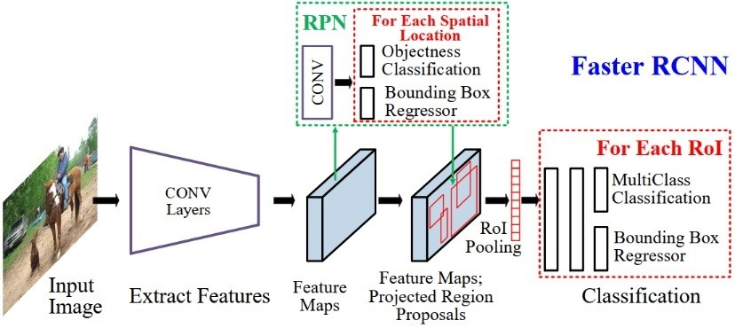

# Pest-and-disease-identification

**TENSOR FLOW:**

TensorFlow is a free and open-source software library for machine learning. It can be used across a range of tasks but has a particular focus on training and inference of deep neural networks. TensorFlow is a symbolic math library based on dataflow and differentiable programming. We are using Faster RCNN algorithm for pest and disease detection.

**FASTER RCNN ALGORITHM:**
Faster RCNN is an object detector that was developed solely by Ross Girshick, a Facebook AI researcher and a former Microsoft Researcher. Fast R-CNN overcomes several issues in R-CNN. As its name suggests, one advantage of the Fast R-CNN over R-CNN is its speed.

                                                                 

                

**TRAINING IMAGES:**
                                  
                              

We’ll be using a TensorFlow implementation of Faster R-CNN which means we need to generate TFRecords for TensorFlow to be able to read our images and their labels. TFRecord is a file format that contains both our images and their annotations. It’s serialized at the dataset-level, meaning we create one set of records for our training set, validation set, and testing set. We’ll also need to create a label map, which maps our label names (RBC, WBC, and platelets) to numbers in a dictionary format.
                       
                        
                            
The dataset for the pest are collected for various pest  and it is used for training the pest model using tensorflow api’s for pest identification
